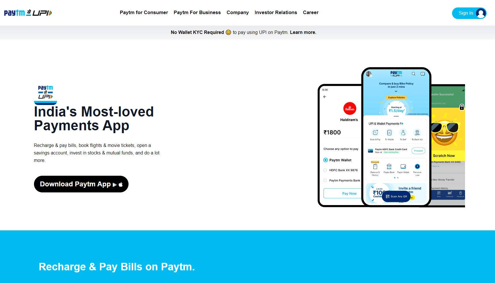

# PAYTM clone.

- Skills Gained in this project
  - Learned about Tailwind CSS which is a utility-first CSS framework.
---

## Time taken to finish this project

- 12 hours taken to complete it.
## Tailwind Project1 Paytm Responsive [Live Link](https://pytmm.netlify.app/)
#### Preview

